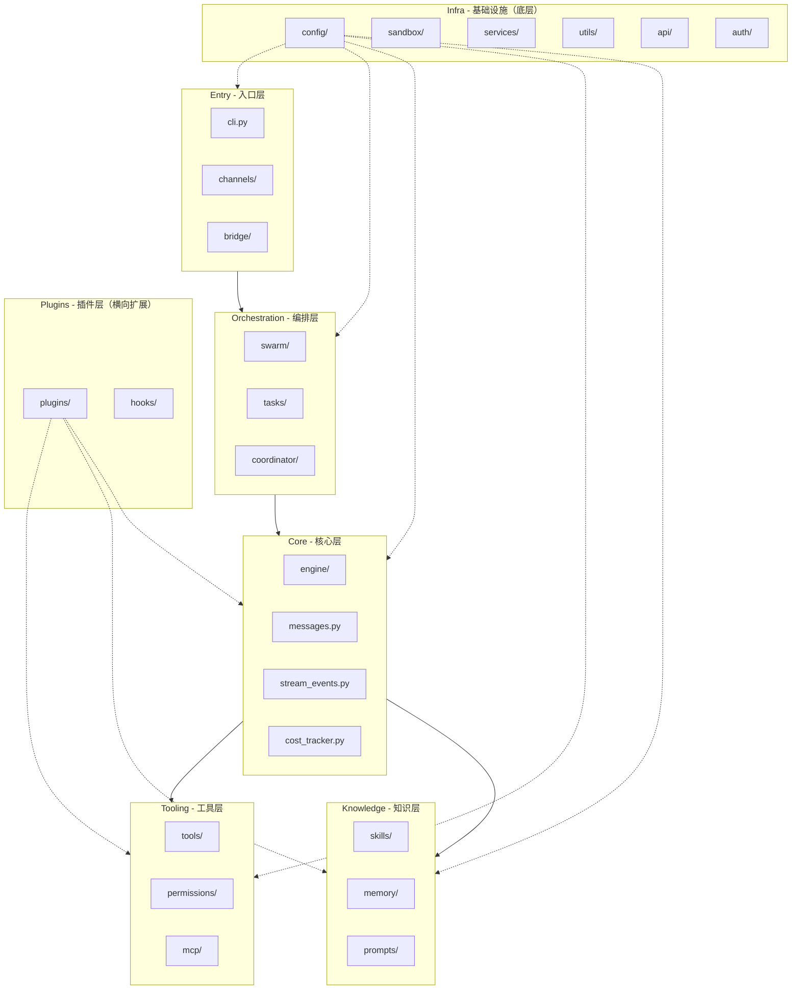

# 架构总览

## 项目简介

OpenHarness 是一个开源的 Python Agent Harness —— 围绕 LLM 构建功能性编码 Agent 的基础设施。它兼容 Claude Code 规范，提供工具使用、技能、记忆和多 Agent 协调能力。

**核心理念**: 模型是 Agent，代码是 Harness。

## 架构：按职责划分

OpenHarness 按**职责**划分模块，从上到下依次为：**入口 → 编排 → 核心 → 工具 → 知识 → 插件 → 基础设施**。依赖单向传递，下层为上层提供支撑。插件是横向扩展机制，不属于纵向依赖链的一环，但在图中为保持完整性而展示。



## 各层详解

### 1. 入口层（Entry）

**模块**: `cli.py` + `channels/` + `bridge/`

外部世界进入 Agent 的入口。

```
src/openharness/
├── cli.py              # Typer CLI 主入口（`oh` 命令）
├── channels/           # IM 渠道（Telegram/Slack/Discord/飞书等）
└── bridge/             # ohmo gateway 与 harness 的桥接

ohmo/                   # Personal Agent 应用（独立子包）
├── gateway/            # HTTP/WebSocket 网关，接收 ohmo-client 请求
├── channels/           # IM 渠道实现（Telegram/Slack/Discord/飞书等）
└── workspace/          # 工作区管理
```

**职责**：接收用户输入（命令行、IM 消息、gateway 调用），统一转换为内部消息格式。不包含任何 Agent 逻辑。

**ohmo 与 harness 的关系**：ohmo 是构建在 harness 之上的 personal-agent 应用，通过 `bridge/` 将 ohmo gateway 的请求路由到 harness 核心，两者共享同一个 Agent 实例。

---

### 2. 编排层（Orchestration）

**模块**: `swarm/` + `tasks/` + `coordinator/`

Agent 的"协作层"——管理多 Agent 协作和后台任务。

| 模块 | 职责 | 关键概念 |
|------|------|----------|
| `swarm/` | 多 Agent（teammate）的生成和进程间通信 | `SubprocessBackend`、`TeammateMailbox`、`PaneBackend` |
| `tasks/` | 后台任务的创建、监控、停止 | `BackgroundTaskManager`、`local_shell_task` |
| `coordinator/` | 任务委派和多 Agent 协调模式 | `CoordinatorMode`、`AgentDefinition` |

**为什么放一起**：它们都涉及" Agent 之间的协作"。Swarm 管理多 Agent 的生命周期，Tasks 管理后台任务（可以由其他 Agent 发起），Coordinator 定义协作模式和任务分配策略。

---

### 3. 核心层（Core）

**模块**: `engine/`

Agent 的"大脑"——唯一包含主循环的地方。

```
src/openharness/engine/
├── query_engine.py    # QueryEngine，对话管理和循环入口
├── query.py          # run_query，实际的 Agent 循环逻辑
├── messages.py       # ConversationMessage 等消息类型
├── stream_events.py   # 流式事件类型（AssistantTextDelta 等）
└── cost_tracker.py   # Token 使用量追踪
```

**职责**：接收用户消息 → 调用 LLM → 处理工具调用 → 循环，直到模型输出最终结果。不直接执行任何外部操作。

---

### 4. 工具层（Tooling）

**模块**: `tools/` + `permissions/` + `mcp/`

Agent 的"手"——所有对外操作都经过此处，并通过权限进行安全管控。

| 模块 | 职责 | 关键文件 |
|------|------|----------|
| `tools/` | 43+ 工具的实现和注册 | `base.py`（含 ToolRegistry）、`*_tool.py` |
| `permissions/` | 工具执行前的安全检查 | `checker.py`（PathRule、CommandRule） |
| `mcp/` | 接入外部 MCP 服务器提供的工具 | `client.py`（支持 stdio、HTTP 和 SSE） |

**工具执行管道**：
```
ToolCall 请求
    ↓
PermissionChecker.evaluate()    ← 权限检查
    ↓
工具执行（Tools / MCP）         ← 实际执行
    ↓
返回 ToolResult
```

钩子（Hooks）在插件层管理，通过插件机制注入到工具执行管道中。

---

### 5. 知识层（Knowledge）

**模块**: `skills/` + `memory/` + `prompts/`

Agent 的"知识"——管理跨轮次的上下文、专业领域知识。

| 模块 | 职责 | 关键概念 |
|------|------|----------|
| `skills/` | 按需从 Markdown 文件加载领域知识 | `SKILL.md`、内置技能、用户技能 |
| `memory/` | 持久化记忆和上下文压缩 | `MEMORY.md`、`memdir.py`、上下文压缩 |
| `prompts/` | 系统 Prompt 的组装和 CLAUDE.md 处理 | `system_prompt.py`、`context.py` |

**为什么放一起**：它们共同回答"Agent 知道什么"这个问题。Skills 提供专业知识，Memory 提供跨会话记忆，Prompts 决定模型看到什么上下文。

---

### 6. 插件层（Plugins）

**模块**: `plugins/` + `hooks/`

功能扩展包和生命周期钩子，可插拔的功能单元。插件是横向扩展机制，可以向任意层注入能力。

| 模块 | 职责 | 关键概念 |
|------|------|----------|
| `plugins/` | 完整的功能扩展包（命令/Hook/Agent/MCP） | `plugin.json`、兼容 Claude Code 插件格式 |
| `hooks/` | 工具执行前后的生命周期事件 | `executor.py`、`events.py` |

**为什么放中间**：虽然插件是横向扩展机制，但为保持层级完整性在此展示。实际依赖关系中 plugins 可注入到 tooling、knowledge、core 等层。

---

### 7. 基础设施（Infra）

**模块**: `config/` + `sandbox/` + `services/` + `utils/` + `api/` + `auth/` + `platforms.py`

支撑整个系统的底层服务，各模块独立且被其他层依赖。

| 模块 | 职责 |
|------|------|
| `config/` | 多层配置加载（文件、环境变量、Schema 校验） |
| `sandbox/` | 沙箱运行时适配器 |
| `services/` | 辅助服务（Cron、Session 存储、Token 估算等） |
| `utils/` | 通用 Shell 辅助函数 |
| `api/` | 多 Provider 的 LLM 调用（Anthropic/OpenAI/Codex/Copilot） |
| `auth/` | 多认证流程的管理（ApiKey/DeviceCode/Browser） |
| `platforms.py` | 平台能力检测（tmux/iterm2 等） |

---

## 数据流

### Agent 主循环

```text
用户输入（入口层）
    ↓
RuntimeBundle 初始化
    ↓
QueryEngine.submit_message()
    ↓
run_query() 循环
    ├─→ auto_compact_if_needed()    # 上下文压缩（知识层）
    ├─→ api_client.stream_message()  # LLM 调用（基础设施层）
    │       ↓
    │   流式响应事件（AssistantTextDelta / AssistantTurnComplete）
    │
    ├─→ 工具执行（如有 tool_use）     # 工具层
    │       ├─→ permission_checker.evaluate()
    │       ├─→ hook_executor.execute(PRE_TOOL_USE)
    │       ├─→ tool.execute()
    │       └─→ hook_executor.execute(POST_TOOL_USE)
    │
    └─→ 消息追加，循环继续
    ↓
返回结果
```

### 工具执行管道

```text
ToolCall 请求（tool_name, tool_input）
    ↓
ToolRegistry.get(tool_name)       # 查询工具
    ↓
PermissionChecker.evaluate()       # 权限检查
    ├─→ 工具允许/拒绝列表
    ├─→ 敏感路径规则
    └─→ 命令规则
    ↓
HookExecutor.execute(PRE_TOOL_USE) # 前置钩子
    ↓
BaseTool.execute()                  # 实际执行
    ↓
HookExecutor.execute(POST_TOOL_USE) # 后置钩子
    ↓
返回 ToolResult
```

## 关键设计决策

### 1. 工具层独立于核心

`engine/` 不直接调用工具，而是通过 `ToolRegistry` + `PermissionChecker` 的管道。权限逻辑与核心循环解耦，可以独立修改或替换。钩子通过插件机制注入。

### 2. 知识层是按需加载的

Skills 在运行时按需加载，不在启动时全部初始化。这样保持冷启动速度，同时支持大量扩展。

### 3. 编排层与核心解耦

后台任务和多 Agent 通过独立的 TaskManager 和 SwarmBackend 管理，不阻塞主 Agent 循环。

### 4. API 层完全抽象

`api/` 对上层隐藏 Provider 差异（Anthropic/OpenAI/Codex/Copilot），上层只看到统一的流式接口。

### 5. 入口层与核心解耦

CLI、TUI、ohmo bridge、IM channels 都是"同一核心的不同入口"，互相不可见，通过 `RuntimeBundle` 共享同一个 Agent 实例。

### 6. 插件层是横向扩展机制

Plugins 可以向任意层注入能力（命令、钩子、Agent、MCP 工具），是横向扩展而非纵向依赖。

## 扩展点

### 添加新工具

继承 `BaseTool` 并注册到 `ToolRegistry`：

```python
class MyToolInput(BaseModel):
    query: str

class MyTool(BaseTool):
    name = "my_tool"
    input_model = MyToolInput

    async def execute(self, args: MyToolInput, ctx: ToolExecutionContext) -> ToolResult:
        return ToolResult(output=f"Result: {args.query}")
```

### 添加新技能

在 `~/.openharness/skills/my-skill/SKILL.md` 创建 Markdown 文件，SkillsLoader 会自动发现并按需加载。

### 添加新插件

创建 `.openharness/plugins/my-plugin/.claude-plugin/plugin.json`，声明 commands/hooks/agents 后插件自动加载。

### 添加新执行后端

在 `swarm/` 中实现 `TeammateExecutor` 协议（`spawn`、`send_message`、`shutdown`），然后在 `BackendRegistry` 中注册即可。

## 进一步阅读

- [Agent 循环引擎](./core/agent-loop.md)
- [工具系统](./core/tools.md)
- [权限系统](./core/permissions.md)
- [钩子系统](./core/hooks.md)
- [记忆系统](./core/memory.md)
- [Swarm 多 Agent](./core/swarm.md)
- [API 客户端](./infrastructure/api-clients.md)
