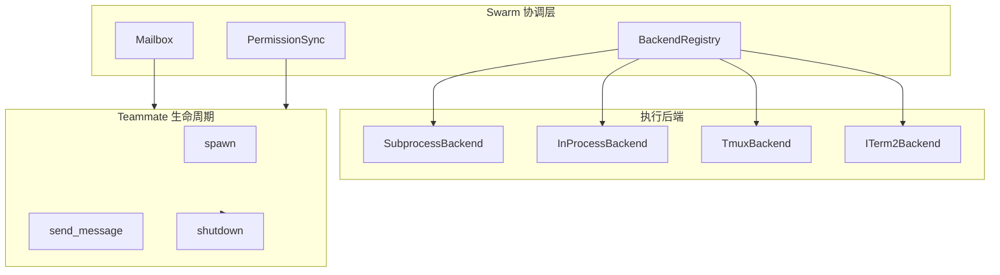

# Swarm 多智能体协调系统

## 概述

Swarm 是 OpenHarness 的多智能体协调子系统，负责 teammate 的生成、生命周期管理、进程间通信和权限同步。它将一个复杂任务分解为多个专业 Agent（teammate），通过 Mailbox 机制进行异步消息传递。

**核心理念**：每个 teammate 是独立进程，通过结构化消息进行协作，而非共享内存。

## 架构总览



## 核心类型

### BackendType

定义支持的后端类型：

```python
BackendType = Literal["subprocess", "in_process", "tmux", "iterm2"]
```

| 后端 | 说明 | 可用性 |
|------|------|--------|
| `subprocess` | 每个 teammate 作为独立子进程运行 | 始终可用 |
| `in_process` | 在同一进程内运行（用于测试） | 始终可用 |
| `tmux` | 在 tmux pane 中运行，支持可视化 | 需要 tmux |
| `iterm2` | 在 iTerm2 pane 中运行 | 需要 iTerm2 + it2 CLI |

### TeammateIdentity

Teammate 的身份标识：

```python
@dataclass
class TeammateIdentity:
    agent_id: str      # 格式: agentName@teamName
    name: str          # 例如: 'researcher'
    team: str          # 所属团队名
    color: str | None  # UI 显示颜色
    parent_session_id: str | None  # 父会话 ID
```

### TeammateSpawnConfig

生成 teammate 的配置：

```python
@dataclass
class TeammateSpawnConfig:
    name: str                    # teammate 名称
    team: str                    # 团队名
    prompt: str                  # 初始任务描述
    cwd: str                     # 工作目录
    parent_session_id: str       # 父会话 ID
    model: str | None           # 模型覆盖
    system_prompt: str | None    # 系统提示词
    color: str | None           # UI 颜色
    permissions: list[str]       # 授予的工具权限
    plan_mode_required: bool     # 是否强制 plan 模式
    allow_permission_prompts: bool  # 是否允许权限提示
    worktree_path: str | None   # git worktree 路径（隔离文件系统）
```

### SpawnResult

生成结果：

```python
@dataclass
class SpawnResult:
    task_id: str              # TaskManager 中的任务 ID
    agent_id: str             # 格式: agentName@teamName
    backend_type: BackendType  # 使用的后端
    success: bool = True      # 是否成功
    error: str | None = None  # 错误信息
    pane_id: PaneId | None    # pane ID（tmux/iterm2 后端）
```

## 执行后端

### SubprocessBackend（默认）

每个 teammate 作为独立子进程运行，通过 stdin/stdout 进行 JSON 消息通信：

```python
class SubprocessBackend:
    type: BackendType = "subprocess"

    async def spawn(self, config: TeammateSpawnConfig) -> SpawnResult
    async def send_message(self, agent_id: str, message: TeammateMessage) -> None
    async def shutdown(self, agent_id: str, *, force: bool = False) -> bool
```

- 使用 `openharness.tasks.manager.BackgroundTaskManager` 管理子进程
- 通过 stdin 发送 `TeammateMessage`，stdout 接收响应
- 始终可用，不依赖外部工具

### TmuxBackend

在 tmux pane 中运行 teammate，支持可视化团队视图：

```python
# 检测是否在 tmux 中运行
is_tmux = os.environ.get("TMUX") is not None

# 创建 teammate pane
async def create_teammate_pane_in_swarm_view(
    name: str,
    color: str | None = None
) -> CreatePaneResult
```

支持操作：
- 创建/销毁 pane
- 设置 pane 边框颜色和标题
- 隐藏/显示 pane（重新平衡布局）

### ITerm2Backend

在 iTerm2 pane 中运行，功能与 TmuxBackend 类似：
- 检测 `ITERM_SESSION_ID` 环境变量
- 需要安装 `it2` CLI 工具
- 支持 pane 创建、销毁、颜色设置

### InProcessBackend

用于测试的内存中后端，不创建实际进程：

```python
class InProcessBackend:
    type: BackendType = "in_process"
```

## 后端注册与检测

### BackendRegistry

全局后端注册表，自动检测可用后端：

```python
class BackendRegistry:
    def get_available_backend() -> BackendType
    def detect() -> BackendDetectionResult
```

`BackendDetectionResult` 包含：

```python
@dataclass
class BackendDetectionResult:
    backend: str           # 应使用哪个后端
    is_native: bool         # 是否运行在后端原生环境中
    needs_setup: bool       # 是否需要额外设置（如安装 it2）
```

### 自动检测顺序

```
1. 检查环境变量（TMUX / ITERM_SESSION_ID）
2. 检查对应 CLI 工具可用性（tmux / it2）
3. 回退到 subprocess（始终可用）
```

## Mailbox 消息系统

### TeammateMailbox

基于文件的异步消息队列：

```python
class TeammateMailbox:
    """每个 teammate 有一个 mailbox 目录，用于接收消息"""

    async def send(agent_id: str, message: TeammateMessage) -> None
    async def receive(agent_id: str) -> TeammateMessage | None
    async def list_pending(agent_id: str) -> list[str]  # 列出待处理消息 ID
```

消息文件存储在 `~/.openharness/agents/{agent_id}/mailbox/inbox/`

### MailboxMessage

```python
class MailboxMessage:
    id: str              # 消息 ID
    from_agent: str       # 发送者 agent_id
    to_agent: str        # 接收者 agent_id
    text: str            # 消息内容
    timestamp: str        # ISO 时间戳
    summary: str | None  # 消息摘要（用于显示）
```

### 消息类型工厂函数

```python
create_idle_notification()       # teammate 进入空闲状态通知
create_shutdown_request()       # 关闭 teammate 请求
create_user_message(text)        # 用户消息
get_agent_mailbox_dir(agent_id) # 获取 mailbox 目录路径
get_team_dir(team)              # 获取团队目录路径
```

## 权限同步

当一个 teammate 请求另一个 teammate 的权限时，使用 `SwarmPermissionSync`：

```python
class SwarmPermissionRequest:
    """跨 teammate 的权限请求"""

class SwarmPermissionResponse:
    """权限响应"""

async def create_permission_request(
    from_agent: str,
    to_agent: str,
    tool_name: str,
    reason: str
) -> SwarmPermissionRequest

async def handle_permission_request(request: SwarmPermissionRequest) -> SwarmPermissionResponse

async def poll_permission_response(request_id: str) -> SwarmPermissionResponse | None

async def send_permission_response(request: SwarmPermissionRequest, granted: bool) -> None
```

流程：
1. Teammate A 调用工具时被权限系统阻止
2. A 向 B 发送 `SwarmPermissionRequest`
3. B 的主控 agent 决定是否授权
4. B 通过 `send_permission_response` 回复
5. A 通过 `poll_permission_response` 轮询结果

## 生命周期管理

### team_lifecycle.py

完整的团队生命周期：

```python
async def create_team(name: str, members: list[str]) -> TeamHandle
async def dissolve_team(name: str) -> None
async def add_teammate(team: str, config: TeammateSpawnConfig) -> SpawnResult
async def remove_teammate(agent_id: str) -> bool
```

### lockfile.py

使用文件锁防止并发问题：

```python
class SwarmLock:
    async def acquire(key: str) -> bool
    async def release(key: str) -> None
    def is_locked(key: str) -> bool
```

锁文件路径：`~/.openharness/agents/.locks/{key}.lock`

## 文件结构

```
src/openharness/swarm/
├── __init__.py           # 公共 API 导出（lazy load POSIX 模块）
├── types.py              # 核心类型定义（BackendType, TeammateIdentity, SpawnResult 等）
├── registry.py            # BackendRegistry 后端注册和自动检测
├── subprocess_backend.py # SubprocessBackend 实现
├── in_process.py         # InProcessBackend（测试用）
├── tmux_backend.py       # TmuxBackend（如果存在）
├── iterm2_backend.py      # ITerm2Backend（如果存在）
├── mailbox.py            # TeammateMailbox 消息系统
├── permission_sync.py    # 跨 teammate 权限同步
├── spawn_utils.py       # teammate 命令构建和环境变量继承
├── team_lifecycle.py    # 团队生命周期管理
├── lockfile.py          # 文件锁机制
└── worktree.py           # git worktree 管理
```

## 与其他模块的关系

- **tasks/**: SubprocessBackend 依赖 `BackgroundTaskManager` 运行子进程
- **coordinator/**: Swarm 是 Coordinator 的底层执行机制
- **permissions/**: SwarmPermissionSync 与权限系统交互
- **engine/**: 父 agent 通过 engine 与 teammate 通信

## 扩展点

添加新的执行后端：

1. 在 `types.py` 中定义 `BackendType` 字面量
2. 实现 `TeammateExecutor` 协议（`spawn`、`send_message`、`shutdown`）
3. 在 `BackendRegistry` 中注册后端检测逻辑
4. 在 `PaneBackend` 协议中实现 pane 管理（如适用）
