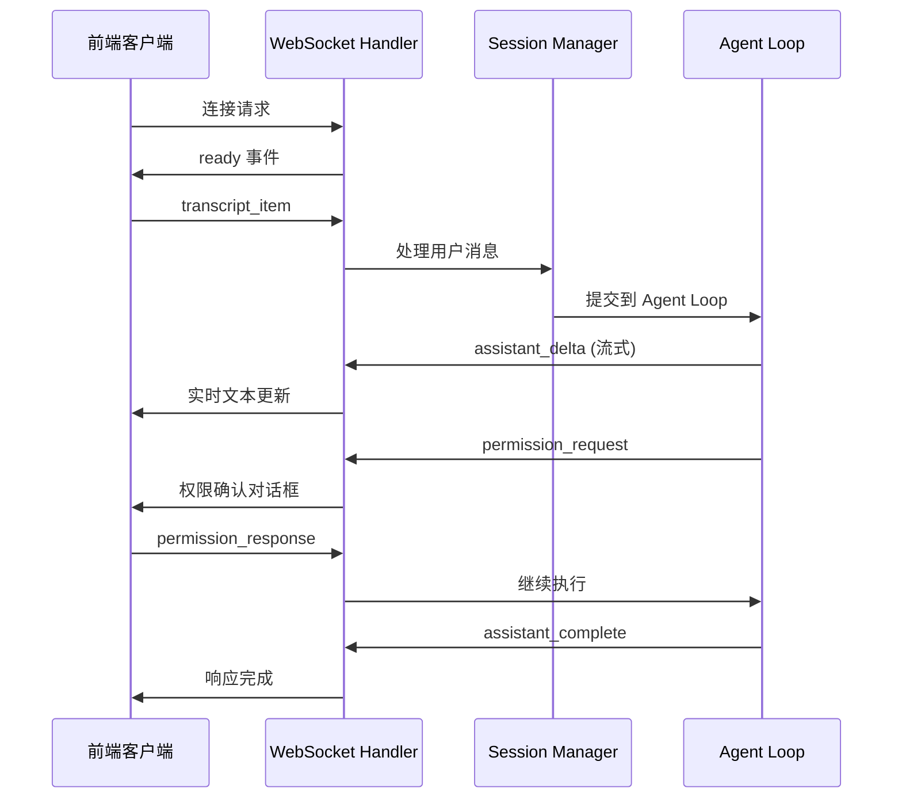

# OpenHarness Web API 实施指南

## 🎯 已完成的架构
启动后端
cd /src/openharness/ui/web
python start.py
### **目录结构**
```
src/openharness/ui/web/
├── __init__.py                 # 模块初始化
├── config.py                   # Web 服务器配置
├── server.py                   # FastAPI 主服务器
├── start.py                    # 启动脚本
├── protocol/                   # 协议模型定义
│   ├── __init__.py
│   └── models.py               # WebSocket 和 REST API 模型
├── websocket/                  # WebSocket 处理
│   ├── __init__.py
│   ├── connection_manager.py  # 连接管理
│   ├── handler.py             # 消息处理
│   └── session_manager.py     # 会话管理
├── api/                        # REST API
│   ├── __init__.py
│   ├── routing.py             # 路由注册
│   └── routes/                # API 路由
│       ├── __init__.py
│       ├── sessions.py        # 会话管理
│       ├── config.py          # 配置管理
│       └── tasks.py           # 任务管理
└── middleware/                 # 中间件
    ├── __init__.py
    ├── cors.py                # CORS 配置
    └── error_handler.py       # 错误处理
```

## 🚀 快速开始

### **1. 启动服务器**

```bash
# 方式一：直接运行启动脚本
python src/openharness/ui/web/start.py

# 方式二：使用 uvicorn
uvicorn openharness.ui.web.server:create_app --host 0.0.0.0 --port 8000 --reload

# 方式三：集成到现有 CLI
oh --web
```

### **2. 访问服务**

- **API 文档**: http://localhost:8000/docs
- **健康检查**: http://localhost:8000/health
- **WebSocket**: ws://localhost:8000/ws

### **3. 测试 WebSocket 连接**

```javascript
// 在浏览器控制台测试
const ws = new WebSocket('ws://localhost:8000/ws');

ws.onopen = () => {
  console.log('WebSocket connected');
  
  // 发送测试消息
  ws.send(JSON.stringify({
    type: 'submit_line',
    content: '你好，请介绍一下自己'
  }));
};

ws.onmessage = (event) => {
  const data = JSON.parse(event.data);
  console.log('Received:', data);
};
```

### **4. 测试 REST API**

```bash
# 创建会话
curl -X POST "http://localhost:8000/api/v1/sessions/" \
  -H "Content-Type: application/json" \
  -d '{"config": {"model": "claude-sonnet-4-6"}}'

# 获取配置
curl "http://localhost:8000/api/v1/config/"

# 获取任务列表
curl "http://localhost:8000/api/v1/tasks/"
```

## 🎨 前端集成示例

### **Vue 3 + WebSocket 客户端**

```vue
<script setup lang="ts">
import { ref, onMounted, onUnmounted } from 'vue'

const ws = ref<WebSocket | null>(null)
const messages = ref<any[]>([])
const inputMessage = ref('')

const connectWebSocket = () => {
  ws.value = new WebSocket('ws://localhost:8000/ws')
  
  ws.value.onopen = () => {
    console.log('WebSocket connected')
  }
  
  ws.value.onmessage = (event) => {
    const data = JSON.parse(event.data)
    handleMessage(data)
  }
  
  ws.value.onclose = () => {
    console.log('WebSocket disconnected')
  }
}

const handleMessage = (data: any) => {
  switch (data.type) {
    case 'ready':
      console.log('Backend ready:', data.data)
      break
    case 'assistant_delta':
      // 处理流式文本
      updateAssistantText(data.text)
      break
    case 'assistant_complete':
      // 完整响应
      messages.value.push({
        role: 'assistant',
        content: data.message.content
      })
      break
    case 'permission_request':
      // 显示权限确认对话框
      showPermissionDialog(data)
      break
  }
}

const sendMessage = () => {
  if (!ws.value || !inputMessage.value) return
  
  ws.value.send(JSON.stringify({
    type: 'submit_line',
    content: inputMessage.value
  }))
  
  messages.value.push({
    role: 'user',
    content: inputMessage.value
  })
  
  inputMessage.value = ''
}

const respondToPermission = (requestId: string, allowed: boolean) => {
  ws.value?.send(JSON.stringify({
    type: 'permission_response',
    request_id: requestId,
    allowed: allowed
  }))
}

onMounted(() => {
  connectWebSocket()
})

onUnmounted(() => {
  ws.value?.close()
})
</script>

<template>
  <div class="chat-container">
    <div class="messages">
      <div v-for="(msg, index) in messages" :key="index" 
           :class="['message', msg.role]">
        {{ msg.content }}
      </div>
    </div>
    
    <div class="input-area">
      <input v-model="inputMessage" @keyup.enter="sendMessage" 
             placeholder="输入消息..." />
      <button @click="sendMessage">发送</button>
    </div>
  </div>
</template>
```

### **REST API 客户端**

```typescript
// 使用 axios
import axios from 'axios'

const apiClient = axios.create({
  baseURL: 'http://localhost:8000/api/v1',
  headers: {
    'Content-Type': 'application/json'
  }
})

// 创建会话
const createSession = async (config: any) => {
  const response = await apiClient.post('/sessions/', { config })
  return response.data
}

// 获取配置
const getConfig = async () => {
  const response = await apiClient.get('/config/')
  return response.data.config
}

// 更新配置
const updateConfig = async (updates: any) => {
  const response = await apiClient.put('/config/', updates)
  return response.data.config
}
```

## 🔧 核心功能说明

### **WebSocket 消息流程**



### **REST API 端点**

| 端点 | 方法 | 描述 |
|------|------|------|
| `/api/v1/sessions/` | POST | 创建会话 |
| `/api/v1/sessions/{id}` | GET | 获取会话详情 |
| `/api/v1/sessions/{id}` | DELETE | 删除会话 |
| `/api/v1/config/` | GET | 获取配置 |
| `/api/v1/config/` | PUT | 更新配置 |
| `/api/v1/tasks/` | GET | 获取任务列表 |
| `/api/v1/tasks/{id}` | GET | 获取任务详情 |

## 📝 待实现功能

### **Phase 1: 基础功能** (已完成)
- ✅ FastAPI 服务器框架
- ✅ WebSocket 连接管理
- ✅ 基础协议模型
- ✅ REST API 路由框架
- ✅ CORS 和错误处理

### **Phase 2: 核心集成** (进行中)
- 🔄 与现有 backend_host.py 的集成
- 🔄 Agent Loop 的 WebSocket 适配
- 🔄 实际的会话管理逻辑
- 🔄 权限确认机制的 Web 适配

### **Phase 3: 高级功能**
- ⏳ 用户认证和授权
- ⏳ 会话持久化
- ⏳ 文件操作 API
- ⏳ 多语言支持
- ⏳ 性能优化

## 🎯 下一步行动

1. **集成现有运行时**
   ```python
   # 在 websocket/handler.py 中
   from openharness.ui.runtime import build_runtime
   
   # 为每个 WebSocket 会话构建运行时
   runtime_bundle = await build_runtime(
       model="claude-sonnet-4-6",
       permission_prompt=web_permission_prompt,
       ask_user_prompt=web_ask_user
   )
   ```

2. **实现 Agent Loop 集成**
   ```python
   # 处理用户消息时
   async for event in runtime_bundle.query_engine.submit_message(content):
       await connection_manager.send_personal({
           "type": "assistant_delta",
           "text": event.text
       }, session_id)
   ```

3. **添加测试**
   ```bash
   # 添加单元测试
   pytest tests/test_web_api/
   
   # 添加集成测试
   pytest tests/test_web_integration/
   ```

这个架构已经为 OpenHarness 提供了完整的 Web API 基础，可以开始实际的 Agent Loop 集成了！